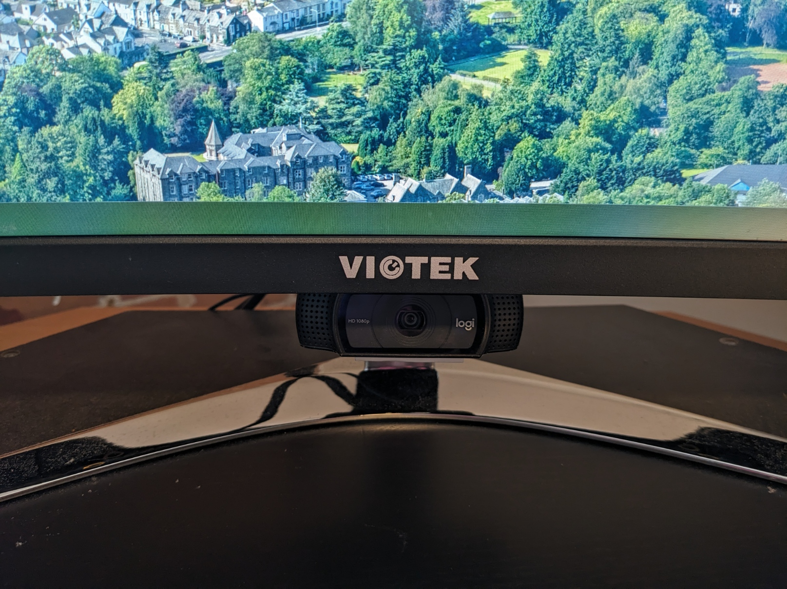
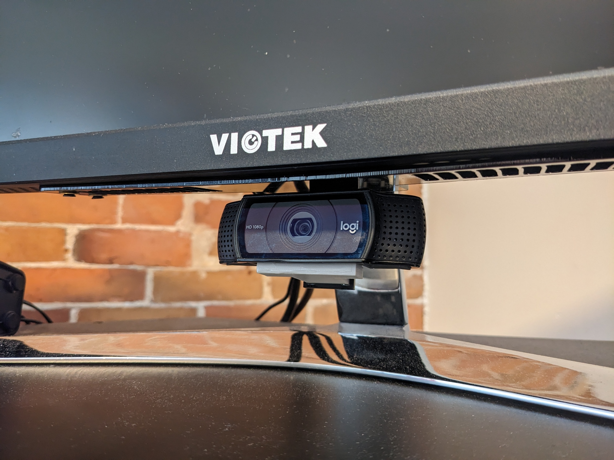
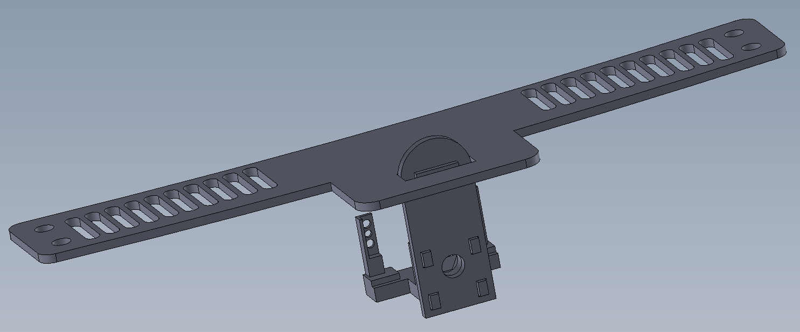
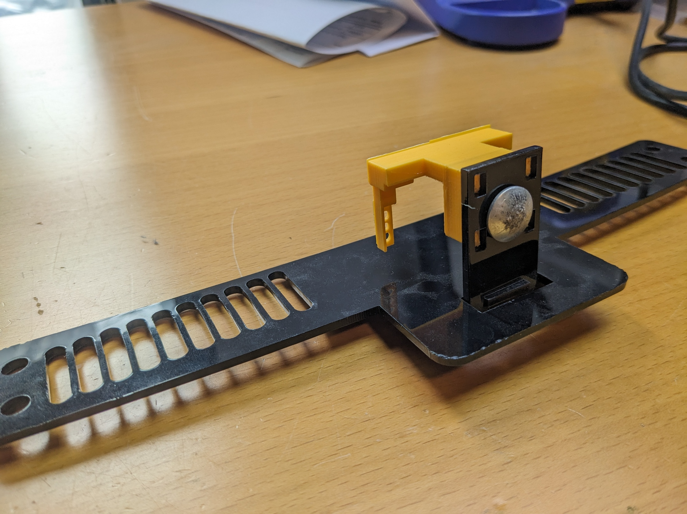
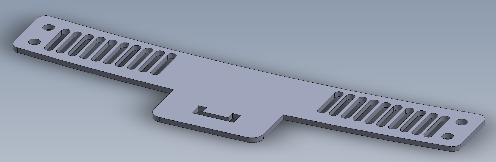
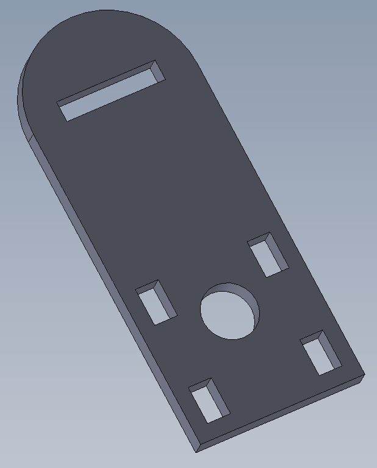
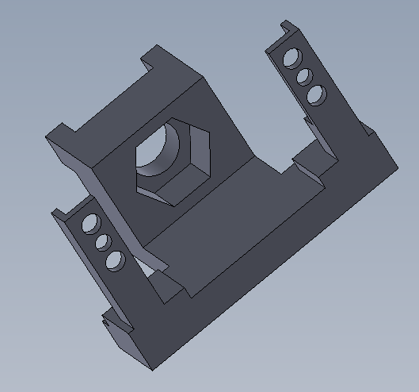

# C920 Camera Mount for Viotek GN34C Ultrawide Monitor

## Camera teardown

To install the mount the camera needs to be completely disassembled. I recorded myself completing this process here:
https://www.youtube.com/watch?v=q0wWCd5nmfU

## Images

## Parts

Raw files for printing and laser cutting can be found in the `./manufacturing` folder.

### Screen mount

The Viotek has many small vent holes at the bottom that are perfectly sized for screws to thread into hence the 4 holes on the edges of the bracket.

### Angle adjuster

I wasn't quite sure what angle would be required to point the camera at my face from under the monitor and I also didn't want the complexity of building an adjustment mechanism so instead I opted for a simple piece of acrylic which can be bent easily with a heat gun.

### C920 adapter

The adapter is designed to replace the default stand which comes pre-installed on the camera. The process to swap them is quite involved however so see the [teardown](#camera-teardown) above.

